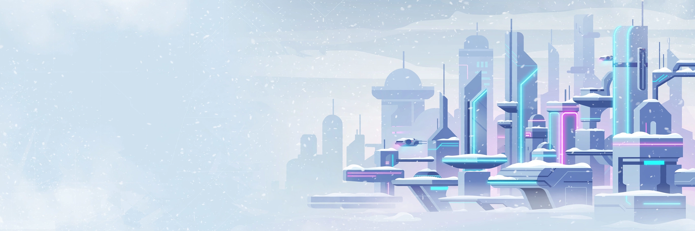
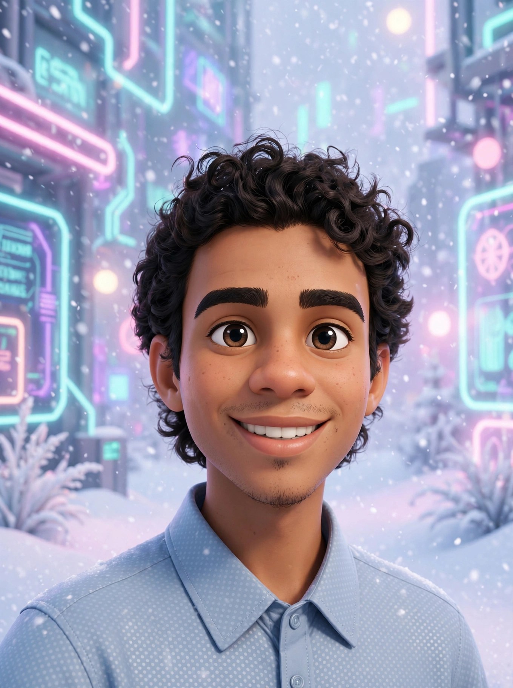
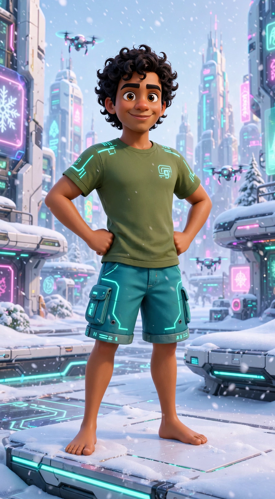

# 👋 Olá, eu sou Micael Nildo Oliveira Souza

<div align="center">


[](https://github.com/mnanimat)
[](https://github.com/mnanimat?tab=followers)
[](https://micaelnildo.com)


> ⚠️ *Imagens cartoon deste perfil foram geradas por Inteligência Artificial*

</div>

---

## 🚀 Sobre Mim

> Construindo projetos criativos que unem **tecnologia, animação 3D, inteligência artificial e desenvolvimento de software.**

Sou desenvolvedor e animador 3D apaixonado por criar soluções que unem criatividade e código. Atualmente foco em:

- 🎮 Desenvolvimento de aplicativos Android
- 🌐 Desenvolvimento Web moderno
- 🎨 Modelagem e Animação 3D com Blender
- 🤖 Integração de IA em ferramentas criativas
- 📦 Softwares multiplataforma e automações

📍 **Feira de Santana - Bahia, Brasil** • 💬 Pergunte-me sobre **Blender, Modelagem & Animação 3D.**

---

## 🛠️ Stack - Tecnologias

<div align="center">

### Linguagens


### Frameworks & Frontend


### Ferramentas


</div>

---

## 📂 Principais Projetos - Clique para Explorar

<div align="center">

| Projeto | Descrição | Stack | Link |
| :--- | :--- | :--- | :--- |
| **🎨 MNAnimat3D** | Software para criação de animações 3D com personagens, poses e biblioteca | JS, Blender, Android | [➡️ Acessar](https://github.com/mnanimat/mnanimat3d) |
| **📱 Planner-mnanimat** | Planner para organizar rotina, estudos e dinheiro | Kotlin | [➡️ Acessar](https://github.com/mnanimat/Planner-mnanimat) |
| **☁️ Nuvem** | Sistema de armazenamento e compartilhamento | JavaScript | [➡️ Acessar](https://github.com/mnanimat/nuvem) |
| **📦 Portal Downloads** | Portal de downloads com catálogo | TypeScript | [➡️ Acessar](https://github.com/mnanimat/portal_downloads) |
| **🏗️ MNCAD** | Ferramenta CAD | TypeScript, GPL-3.0 | [➡️ Acessar](https://github.com/mnanimat/mncad) |
| **🌐 Portal** | Sites, Landing Pages e Sistemas Web | TS, MIT | [➡️ Acessar](https://github.com/mnanimat/portal) |

</div>

<details>
<summary><b>📦 Ver todos os releases para download (clique aqui)</b></summary>
<br>

> Todos os meus projetos têm releases públicos. Baixe direto do GitHub:

[](https://github.com/mnanimat/mnanimat3d/releases)
[](https://github.com/mnanimat/portal_downloads/releases)
[](https://github.com/mnanimat/nuvem/releases)
[](https://github.com/mnanimat/mncad/releases)
[](https://github.com/mnanimat/Planner-mnanimat/releases)

</details>

---

## 📊 Estatísticas Interativas

<div align="center">


</div>

---

## 🎨 Galeria - Estilo Cartoon

<div align="center">

<table>
<tr>
<td width="50%" align="center">
<br>
<sub>⚠️ Gerado por Inteligência Artificial - Estilo Cartoon Cyberpunk Neve</sub>
</td>
<td width="50%" align="center">
<br>
<sub>⚠️ Gerado por Inteligência Artificial - Tons claros com textura de neve</sub>
</td>
</tr>
</table>

</div>

---

## 🎯 Objetivos 2026

```js
const micael = {
  foco: ["Criar ferramentas para animação 3D", "Desenvolver apps Android"],
  aprendendo: ["Inteligência Artificial aplicada", "VFX Avançado"],
  colaborando: "Projetos Open Source",
  contato: "Vamos construir algo incrível juntos? 🚀"
}
```

- [x] Criar ferramentas para animação 3D
- [x] Desenvolver aplicativos Android
- [x] Publicar projetos Open Source
- [x] Compartilhar conhecimento
- [ ] Transformar Projetos Digitais em Produtos Físicos
- [ ] Integrar IA Local em softwares
- [ ] Lançar MNAnimat3D v2.0

---

## 📫 Conecte-se comigo

<div align="center">

[](https://github.com/mnanimat)
[](https://micaelnildo.com)
[](mailto:contato@micaelnildo.com)

</div>

---

<div align="center">

### ❄️ Obrigado pela visita! ❄️


> Se algum projeto foi útil, considere deixar uma ⭐!

**Feito com Inteligência Artificial e Criatividade Humana • Estilo: tons claros com textura de neve, cores vibrantes cyberpunk**

*Fontes usadas no site: Space Grotesk, Inter, JetBrains Mono - SIL Open Font License (uso comercial permitido)*

</div>
